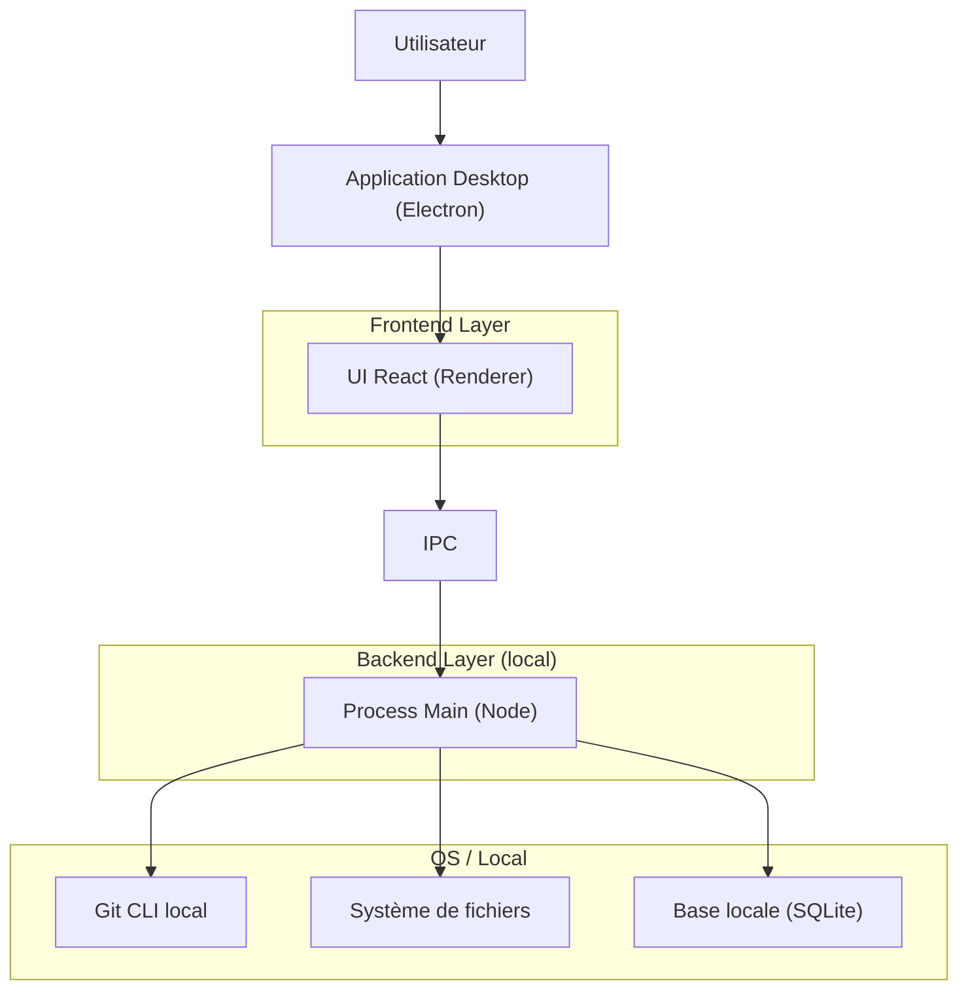
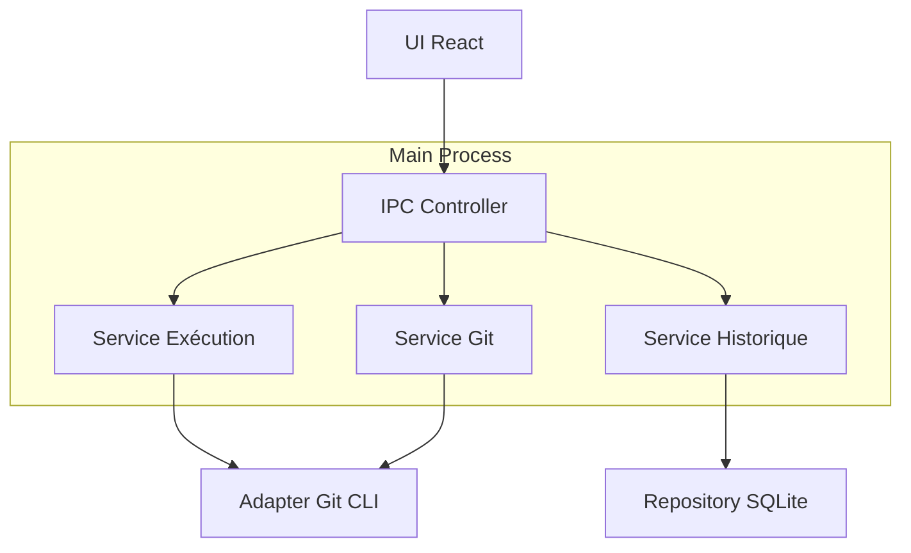
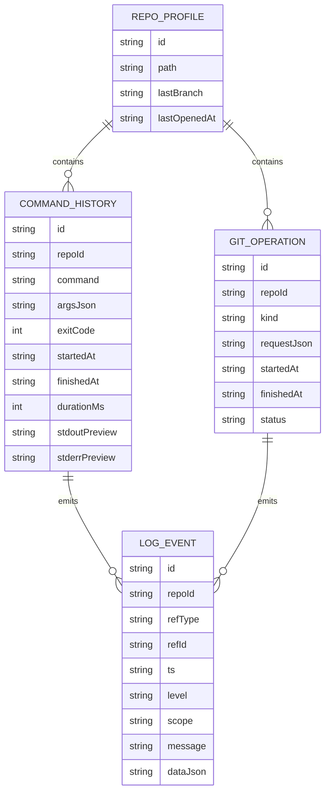

## 1.Architecture design


## 2.Technology Description
- Frontend: React@18 + react-router + tailwindcss@3 (thème sombre) + vite
- Backend: Electron (main process Node.js) via IPC
- Persistence: SQLite locale (ex: better-sqlite3) ou équivalent

## 3.Route definitions
| Route | Purpose |
|---|---|
| / | Choix du dépôt (récents + validation repo) |
| /console | Console multi-onglets (commandes, git, historique, logs) |
| /settings | Paramètres, diagnostics, export logs |

## 4.API definitions (If it includes backend services)
### 4.1 Types partagés (TypeScript)
```ts
type RepoRef = { path: string; name?: string };

type CommandRunRequest = {
  repoPath: string;
  command: string;
  args?: string[];
  env?: Record<string, string>;
  cwd?: string;
};

type CommandRunResult = {
  runId: string;
  startedAt: string;
  finishedAt?: string;
  exitCode?: number;
  stdout: string;
  stderr: string;
  durationMs?: number;
};

type GitOpKind = "amend" | "rebase" | "cherry-pick";

type GitValidation = {
  ok: boolean;
  checks: Array<{ name: string; ok: boolean; message?: string }>;
};

type GitOperationRequest =
  | { kind: "amend"; repoPath: string; message?: string; stageAll?: boolean }
  | { kind: "rebase"; repoPath: string; upstream: string; interactive: boolean }
  | { kind: "cherry-pick"; repoPath: string; commits: string[]; mainline?: number };

type LogEvent = {
  ts: string;
  level: "debug" | "info" | "warn" | "error";
  scope: "command" | "git" | "validation" | "storage";
  message: string;
  data?: unknown;
};
```

### 4.2 API IPC (renderer -> main)
- `repo.select()` -> `RepoRef`
- `repo.validate(repoPath)` -> `GitValidation`
- `command.run(req: CommandRunRequest)` -> `CommandRunResult`
- `command.cancel(runId)` -> `{ ok: boolean }`
- `history.list({ repoPath, q, limit, offset })` -> `{ items, total }`
- `history.replay(historyId)` -> `CommandRunResult`
- `git.validateBefore(op: GitOperationRequest)` -> `GitValidation`
- `git.execute(op: GitOperationRequest)` -> `{ result: CommandRunResult; logs: LogEvent[] }`
- `logs.export({ repoPath, format })` -> `{ filePath: string }`

## 5.Server architecture diagram (If it includes backend services)


## 6.Data model(if applicable)
### 6.1 Data model definition


### 6.2 Data Definition Language
Repo profiles (repo_profiles)
```sql
CREATE TABLE repo_profiles (
  id TEXT PRIMARY KEY,
  path TEXT NOT NULL,
  last_branch TEXT,
  last_opened_at TEXT NOT NULL
);
CREATE UNIQUE INDEX idx_repo_profiles_path ON repo_profiles(path);
```
Historique commandes (command_history)
```sql
CREATE TABLE command_history (
  id TEXT PRIMARY KEY,
  repo_id TEXT NOT NULL,
  command TEXT NOT NULL,
  args_json TEXT,
  exit_code INTEGER,
  started_at TEXT NOT NULL,
  finished_at TEXT,
  duration_ms INTEGER,
  stdout_preview TEXT,
  stderr_preview TEXT
);
CREATE INDEX idx_command_history_repo_started ON command_history(repo_id, started_at DESC);
```
Opérations Git (git_operations)
```sql
CREATE TABLE git_operations (
  id TEXT PRIMARY KEY,
  repo_id TEXT NOT NULL,
  kind TEXT NOT NULL,
  request_json TEXT NOT NULL,
  started_at TEXT NOT NULL,
  finished_at TEXT,
  status TEXT NOT NULL
);
CREATE INDEX idx_git_ops_repo_started ON git_operations(repo_id, started_at DESC);
```
Logs (log_events)
```sql
CREATE TABLE log_events (
  id TEXT PRIMARY KEY,
  repo_id TEXT NOT NULL,
  ref_type TEXT NOT NULL,
  ref_id TEXT NOT NULL,
  ts TEXT NOT NULL,
  level TEXT NOT NULL,
  scope TEXT NOT NULL,
  message TEXT NOT NULL,
  data_json TEXT
);
CREATE INDEX idx_logs